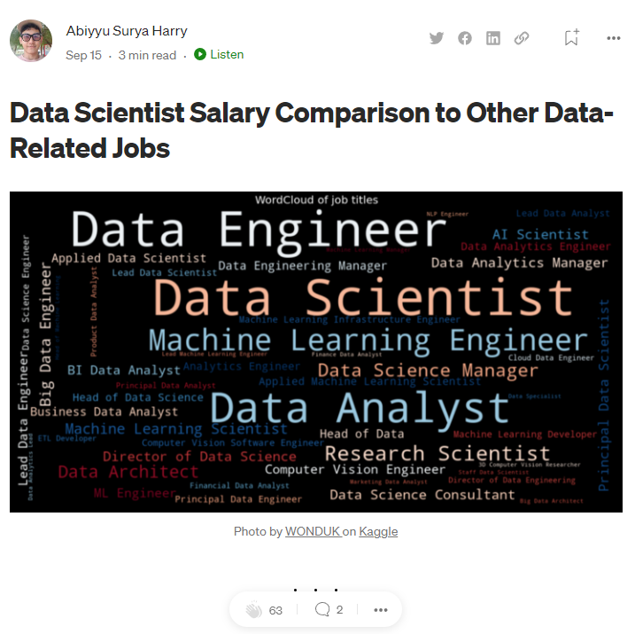

# Data-science-blog-post

This project is for Udacity course
I use numpy, pandas, matplotlib, and seaborn libraries
My curiosity about the data science job's salaries has got me to write this blog
The result can give us sume insight about the salary of data-related jobs
I’d like to thank ai-jobs.net Salaries for aggregating this data!
I put my code in note book called 'Blog Post.ipnyb' and the file in 'ds_salaries.csv'

Here's the blog post
https://medium.com/@abiyyushofficial/data-scientist-salary-comparison-to-other-data-related-jobs-ccb63ae3916a
